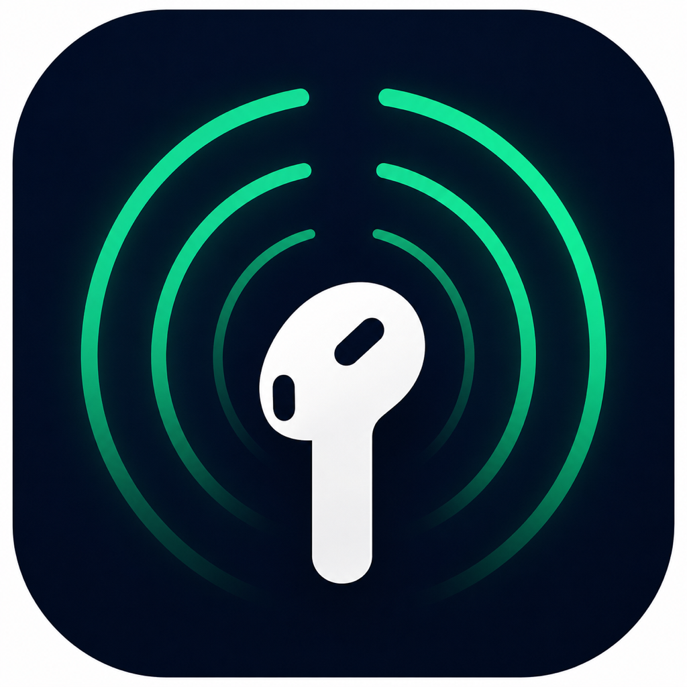

<p align="center">
  
</p>

<h1 align="center">온음 (On-Eum)</h1>

<p align="center">
  <strong>소리 없는 위협을, 듣지 못하는 당신 대신 AI가 듣습니다.</strong>
</p>

<p align="center">
  <a href="https://developer.apple.com/ios/"></a>
  <a href="https://reactnative.dev/"></a>
  <a href="https://swift.org/"></a>
  <a href="https://www.typescriptlang.org/"></a>
</p>

---

## 🧩 문제 인식

**노이즈 캔슬링 이어폰을 끼는 순간, 우리 모두는 "상황적 청각장애"를 겪습니다.**

거리의 상황은 최악의 조건을 갖추고 있습니다:

- 전동 킥보드와 전기차는 엔진 소음이 없는 **소리 없는 이동수단**
- 보행자는 노이즈 캔슬링으로 **귀를 닫고** 걷는 현대인
- 뒤에서 다가오는 위협은 눈으로 볼 수 없고, 귀마저 차단되면 **피할 방법이 없습니다**

> *"소리 없는 위협을, 듣지 못하는 사람들"*
> — 이 치명적인 안전의 공백을 AI가 대신 들어줄 수 있다면?

---

## 💡 솔루션

**온음(On-Eum)** — 세상의 모든 소리(온음)를 분석해 보행자를 지키는 따뜻한(溫) AI 솔루션.

뒤에서 다가오는 킥보드 소리를 AI가 감지하고,
에어팟을 통해 **경고음 + 진동**으로 즉각 알려줍니다.
음악은 자동으로 작아지고, 위험이 지나가면 다시 원래대로.

**장애인만을 위한 서비스가 아닙니다.**
노이즈 캔슬링을 끼는 모든 현대인 보행자를 위한 안전 인프라입니다.

---

## ✨ 핵심 기능

<table>
<tr>
<td width="50%">

### 🛡️ 실시간 보호
- 0.1초 단위 오디오 분석
- 킥보드 / 오토바이 / 차량 자동 구분
- 위험 방향(좌/우) 추정
- 3초 쿨다운으로 알림 과부하 방지

</td>
<td width="50%">

### ⚡ 즉각 경고
- 햅틱 3연타 진동 (3가지 패턴)
- 오디오 덕킹 (음악 볼륨 자동 ↓)
- 경고음 전송 (볼륨 커스텀)
- 위험 해제 시 자동 복원

</td>
</tr>
<tr>
<td width="50%">

### 🔋 배터리 최적화
- 적응형 감지 (조용할 땐 절약 모드)
- 백그라운드에서도 계속 보호
- 전화/Siri 인터럽트 자동 복구

</td>
<td width="50%">

### 🎧 스마트 연동
- AirPods 연결 자동 감지
- Apple Watch 즉시 햅틱 (준비됨)
- 감지 기록 + 위험 지점 지도

</td>
</tr>
</table>

---

## 🖥️ 화면 미리보기

| 안전 모드 | 위험 감지 | 기록 | 설정 |
|:---------:|:---------:|:----:|:----:|
| 🟢 레이더 펄스 | 🔴 위험 카드 + 방향 | 📋 날짜별 로그 | ⚙️ 민감도/알림 |
| SAFE · Listening | DANGER · 킥보드 | 위험등급 태그 | 볼륨/패턴 선택 |

---

## 🚀 시작하기

```bash
# 클론
git clone https://github.com/Duckcchun/On-Eum.git
cd On-Eum

# 설치
npm install
cd ios && pod install && cd ..

# 실행 (실제 iPhone 필요)
npx react-native run-ios --device
```

> 💡 **시뮬레이터**에서도 UI 확인 가능 (마이크/햅틱은 실기기만)
>
> ```bash
> npx react-native run-ios --simulator="iPhone 16 Pro" --scheme temp_rn
> ```

<details>
<summary><strong>📋 요구 사항</strong></summary>

| 항목 | 버전 |
|------|------|
| macOS | Ventura+ |
| Xcode | 15+ |
| Node.js | 18+ |
| CocoaPods | 최신 |
| 기기 | 실제 iPhone (마이크/햅틱) |

</details>

---

## 🧠 AI 소리 분류 (ML)

현재는 RMS 강도 기반으로 위험 유형을 구분하며,
**TensorFlow Lite 모델을 넣으면 더 정확한 분류**가 가능합니다.

```
ml/
├── train_model.py      ← 학습 스크립트 (바로 실행 가능)
├── requirements.txt    ← Python 의존성
└── GUIDE_ML.md         ← 데이터 수집 ~ 학습 ~ 앱 적용 전체 가이드
```

<details>
<summary><strong>빠른 적용법</strong></summary>

```bash
# 학습
cd ml && pip install -r requirements.txt
python train_model.py --data_dir ./data --output_dir ./output

# 앱에 넣기
cp output/sound_classifier.tflite ios/OnEum/
cp output/sound_labels.txt ios/OnEum/
# → Xcode에서 Bundle Resources에 추가 → 빌드 → 끝!
```

</details>

---

## 🏗️ 기술 아키텍처

```
┌─────────────────────────────────────────────────────────────┐
│                        React Native (JS)                     │
├──────────┬──────────┬──────────┬──────────┬─────────────────┤
│ Home     │ History  │ Stats    │ Settings │ Map             │
├──────────┴──────────┴──────────┴──────────┴─────────────────┤
│                    AppContext (전역 상태)                      │
├──────────────────────┬──────────────────────────────────────┤
│   ThreatDetector     │   AlertService                       │
│   (분석 + ML 연동)    │   (경고 트리거)                       │
├──────────────────────┴──────────────────────────────────────┤
│                    Native Bridge (JS ↔ Swift)                │
├─────────────────────────────────────────────────────────────┤
│                     iOS Native (Swift)                        │
├──────────┬──────────┬──────────┬──────────┬─────────────────┤
│ Audio    │ Alert    │ Route    │ Sound    │ Watch           │
│ Buffer   │ Action   │ Manager  │ Classifier│ Session        │
│ Manager  │ Manager  │          │ (TFLite) │ Manager        │
├──────────┴──────────┴──────────┴──────────┴─────────────────┤
│              AVFoundation · WatchConnectivity                 │
└─────────────────────────────────────────────────────────────┘
```

---

## 📂 프로젝트 구조

<details>
<summary>전체 구조 보기</summary>

```
On-Eum/
├── App.tsx                    진입점 + 네비게이션
├── src/
│   ├── context/AppContext.tsx  전역 상태 + 영속성
│   ├── components/
│   │   ├── Icon.tsx           커스텀 아이콘 시스템
│   │   └── Skeleton.tsx       로딩 스켈레톤
│   ├── i18n/                  다국어 (ko/en)
│   ├── navigation/TabBar.tsx  하단 탭바
│   ├── screens/               5개 화면
│   ├── native/                네이티브 브릿지 (3개)
│   └── services/              비즈니스 로직 (3개)
├── ios/OnEum/                 Swift 네이티브 모듈 (5개)
├── watchOS/                   Apple Watch 앱 (준비)
├── ml/                        ML 학습 파이프라인
└── PRIVACY_POLICY.md          개인정보 처리방침
```

</details>

---

## 🔐 프라이버시

| 원칙 | 설명 |
|------|------|
| 🚫 녹음 저장 없음 | 오디오는 분석 후 즉시 폐기 |
| 🚫 서버 전송 없음 | 모든 처리가 기기 내에서 완결 |
| 📍 위치는 선택 | 핵심 기능은 위치 없이도 동작 |
| 🔒 투명한 정책 | [PRIVACY_POLICY.md](./PRIVACY_POLICY.md) |

---

## 🗺️ 로드맵

- [x] 실시간 오디오 감지 + 경고 시스템
- [x] UI/UX 완성 (탭 네비게이션 + 레이더 + 카드)
- [x] 백그라운드 실행 + AirPods 감지
- [x] 방향 감지 (스테레오 L/R)
- [x] 적응형 배터리 최적화
- [x] 다국어 지원 (한/영)
- [x] ML 모델 연동 인프라
- [ ] TensorFlow Lite 모델 학습/적용
- [ ] Apple Watch 앱 배포
- [ ] App Store 출시
- [ ] 위젯 (잠금화면)

---

## 🤝 기여

버그 리포트, 기능 제안, PR 모두 환영합니다!

---

<p align="center">
  <strong>온음</strong>과 함께 안전하게 걸으세요. 🎧🛡️
</p>

<p align="center">
  <sub>MIT License © 2024 Duckcchun</sub>
</p>
